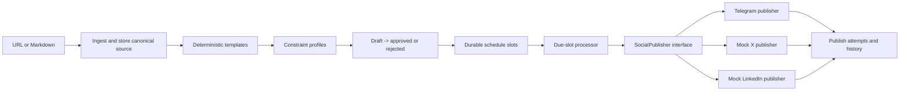

# Social Media Studio — Design Note

## Problem and boundary

Social Media Studio turns one **stored canonical blog post** into a reviewable social campaign. It deliberately focuses on the backend reliability concerns in the capstone: deterministic constrained variants, a gated review workflow, adapter isolation, durable scheduling, and idempotent delivery. It does **not** generate images, track analytics or engagement, publish to real X or LinkedIn accounts, or use probabilistic AI text generation.

> The stored `campaigns.canonicalContent` field is the source of truth. Variant generation accepts only a campaign identifier, reloads that stored source, and never consumes text from the browser request.

## Data model

| Entity | Responsibility | Key invariant |
| --- | --- | --- |
| `campaigns` | Stores the canonical URL or Markdown/text source. | A campaign belongs to one user and retains one canonical source. |
| `variants` | Holds one X, LinkedIn, and Telegram post with workflow status. | One platform variant per campaign; invalid content cannot be persisted. |
| `scheduleSlots` | Stores a scheduled delivery and its stable key. | `variantId + scheduledAt` and `idempotencyKey` are both unique. |
| `publishAttempts` | Records every started, successful, failed, and duplicate outcome. | History is append-only; delivery details are retained. |
| `mockDeliveries` | Saves mock X/LinkedIn previews and supplies a unique ledger. | The idempotency key is unique, so a repeated mock call returns the original preview. |
| `schedulerSettings` | Owns the recurring callback identifier for an account. | The callback is resolved by platform-issued task UID, never by request payload. |

## Service contract

| Surface | Purpose | Important refusal or guarantee |
| --- | --- | --- |
| `campaign.create` | Ingest a safe `https?` URL or pasted Markdown/text and store source. | Rejects empty content and disallowed URL targets. |
| `campaign.generateVariants` | Derives three deterministic templates from the stored source. | Validates each generated draft before insertion. |
| `campaign.editVariant` | Re-validates edited content and returns it to draft. | A violation returns a client-visible bad request. |
| `campaign.reviewVariant` | Approves or rejects a draft. | Scheduling requires `approved`. |
| `campaign.scheduleVariant` | Creates a durable UTC time slot. | Refuses unapproved variants with a 4xx error. |
| `campaign.runDueProcessor` | Claims and publishes due slots. | Atomic claim plus stable key prevents concurrent duplicate work. |
| `scheduler.activate` | Creates a recurring callback after deployment. | Stores the task UID on `schedulerSettings`. |

## Architecture

## Reliability model

The processor selects due or stale-claimed slots, attempts a conditional database claim, and increments the attempt number only for the successful claimer. Every adapter receives the stable `sha256(variantId:scheduledAt)` idempotency key. Mock publishers store this key under a database uniqueness constraint; a retry returns the original mock delivery rather than creating a second one. The processor stores a success record and marks the slot and variant as published atomically after the adapter reports delivery.

Telegram’s Bot API does not expose a first-class idempotency header. The application therefore protects completed Telegram slots at the database boundary and includes the stable key in the message for auditability. An infrastructure crash after Telegram accepts a message but before its response is recorded is represented in the documentation as an external API limitation; the mock adapter and processor tests provide deterministic proof of exactly-once behavior at the application boundary.

## Scheduler design

The recurring runner is an authenticated server-side callback at `/api/scheduled/due-slots`, not an in-process timer. A user enables it after the site is published; the app creates a per-owner recurring job, persists the returned task UID, and the callback looks up the owner exclusively by that UID. The handler is itself idempotent because each slot is conditionally claimed and keyed before delivery.

## Explicit non-goal

This implementation intentionally avoids image generation, engagement analytics, multi-tenant agency workflows, A/B variants, and real X/LinkedIn publishing so that the capstone core remains small, explainable, deterministic, and testable.
