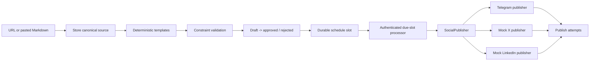

# Social Media Studio

Social Media Studio is a **TypeScript full-stack publishing system** for turning one stored canonical blog post into a controlled, scheduled social campaign. It generates deterministic, platform-specific X, LinkedIn, and Telegram variants; enforces constraints before review; refuses to schedule unapproved content; and records all delivery attempts in a durable publish history.

> **Core promise:** one canonical source, a human review gate, one stable idempotency key per variant and time slot, and one adapter seam for every publisher.

## Scope

The project focuses on the capstone’s reliability requirements rather than content-generation novelty. Templates are deterministic and always read the stored `campaigns.canonicalContent` value. Constraint profiles block invalid content prior to review. The real publisher is Telegram, while X and LinkedIn are intentional local mock publishers that store delivery previews in the database.

| Included | Deliberately not included |
| --- | --- |
| URL or Markdown/text source ingestion | Image generation |
| Deterministic X, LinkedIn, and Telegram templates | Analytics and engagement tracking |
| Constraint validation, editing, approval, and rejection | Real X or LinkedIn accounts |
| Database-backed time slots and publish attempts | A/B variants and agency tenancy |
| Telegram plus mock publisher adapters | Probabilistic AI generation |
| Idempotent retries and a recurring due-slot callback | In-process timers or background loops |

## Architecture



The full data model, API surface, idempotency strategy, and stated non-goal are in [DESIGN.md](./DESIGN.md).

## One-command local run

Install dependencies once with `pnpm install`, then start the app with the single development command below.

```bash
pnpm dev
```

The app starts a TypeScript Express server and Vite client. Sign in through the app, then use the **Canonical source** form to create a campaign.

## Seed path for reviewers

No mock customer content or reviews are used. The reproducible campaign seed is the authored technical source in [`sample-post.md`](./sample-post.md).

1. Start the app with `pnpm dev` and sign in.
2. Choose **Paste text**, name the campaign `Reliable publishing`, and paste `sample-post.md` into the stored Markdown/text field.
3. Store the source and click **Generate 3 variants**.
4. Approve any draft, assign a time two minutes ahead, and save the slot.
5. For a local proof, click **Run due now** after the time has passed. The mock X and LinkedIn adapters write a preview and the history retains the result.

## Telegram configuration

Copy `.env.example` to `.env` for an independent local deployment, or set the same values in the hosting environment. Never commit a real token.

```dotenv
TELEGRAM_BOT_TOKEN=replace_with_botfather_token
TELEGRAM_CHAT_ID=replace_with_owned_chat_or_channel_id
```

Telegram delivery uses `sendMessage`. Create a bot via BotFather and provide a chat or channel identifier that **you own**. X and LinkedIn use local mock publishers by default. Set `PUBLISHER_X`, `PUBLISHER_LINKEDIN`, or `PUBLISHER_TELEGRAM` only when intentionally changing the adapter map; no business-logic code changes are required.

## Automatic scheduling

The scheduled callback is `/api/scheduled/due-slots`. It is not an in-process timer and therefore survives autoscaling and restarts. After the app is published, use the **Activate auto-run** control to create the every-minute server-side schedule (`0 * * * * *`, UTC). The hosting scheduler authenticates the callback, the handler looks up its scheduler configuration by platform-issued task UID, and then the database-backed processor claims only due or stale slots.

For local review, the **Run due now** control invokes the same processor with no external timer dependency. The local check is useful for acceptance probes; the recurring task itself requires the published site because the scheduler calls the production route.

## Reliability guarantees and known limitation

The database prevents duplicate `variantId + scheduledAt` slots and duplicate idempotency keys. Due slots are conditionally claimed, so concurrent processors cannot work the same claim. Every adapter receives the stable SHA-256 key. Mock publishers additionally enforce uniqueness on that key and return the original preview on a retry.

Telegram does not provide an application-controlled idempotency header. The app protects the completed database slot before a normal retry and includes the stable key in the delivered text for auditability. A crash strictly between Telegram accepting a request and recording its response is an unavoidable third-party ambiguity; it is surfaced in the history/retry model rather than hidden. The deterministic mock path proves repeat-safety at the application boundary.

## Testing

Run the deterministic tests and compiler check with:

```bash
pnpm test
pnpm check
```

The test suite covers generated constraints, blocked invalid content, approved-only scheduling, stable-key duplicate protection, an interrupted/resumed processor, adapter swapping, and the Telegram credential check when credentials are configured.

## Submission materials

| File | Purpose |
| --- | --- |
| [`DESIGN.md`](./DESIGN.md) | Design, data model, contracts, and reliability boundaries. |
| [`EVIDENCE.md`](./EVIDENCE.md) | Acceptance-probe evidence and exact test mapping. |
| [`BUILDLOG.md`](./BUILDLOG.md) | Honest AI assistance record. |
| [`.env.example`](./.env.example) | Safe variable names and placeholders only. |
| [`sample-post.md`](./sample-post.md) | Reviewer-ready canonical campaign seed. |

## Repository hygiene

The project is intended for the selected `Madvith-d/flyrank-capstone-social-studio` repository. Its `.gitignore` excludes `.env` files, and `.env.example` carries placeholders only. Before submitting, ensure the repository is public and the current branch is pushed without secrets.
